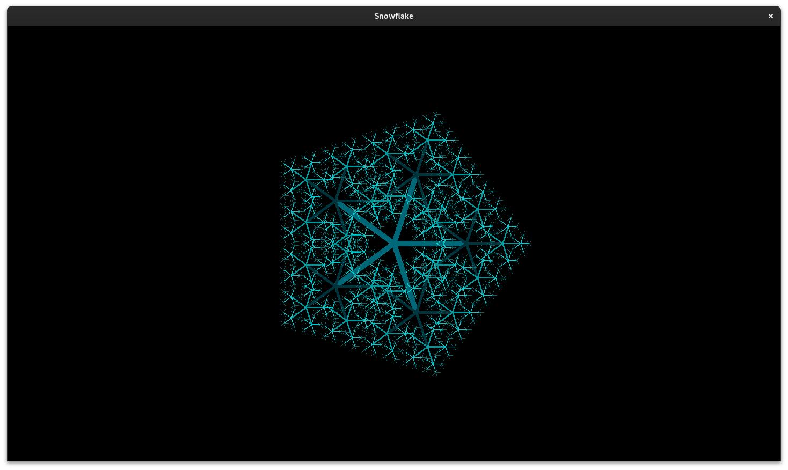

# Back to BASIC 
This is a collection of programs I have written for [FreeBASIC](https://freebasic.net/).  
Its a project which I personally found pretty interesting for recreational program with a delightful syntax. I plan on creating some programs for this language and sharing the code for people interested.

## Snowflake
This code depends on [Raylib](https://github.com/raysan5/raylib), another cool project which I use frequently.  

